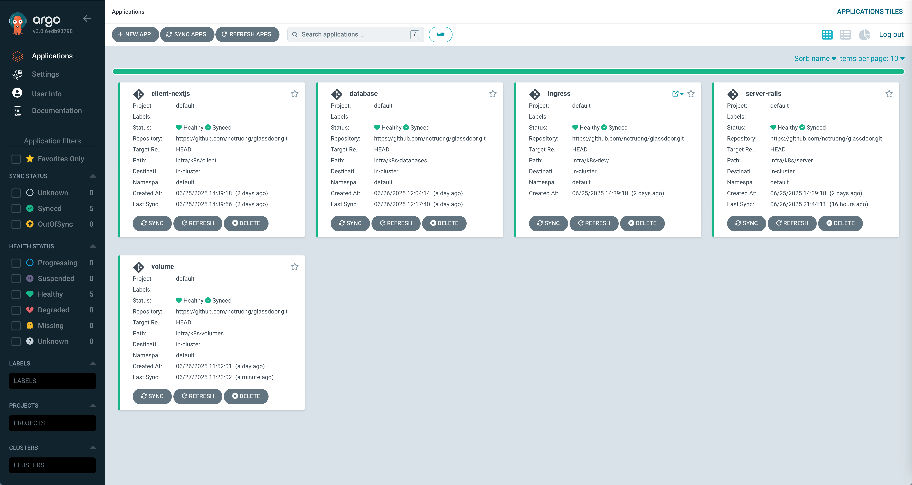

# Glassdoor recruitment system `In-progress`
Build a website for recruitment, like glassdoor. Providing functionalities to approve/reject job application.
In this project, we basically have:
- Backend by Ruby on Rails
- Frontend by NextJS
- API by GraphQL
- Elasticsearch
- Rspec Unit tests
- PostgreSQL
Check my other repository out if you want to see NodeJS, NextJS with Mongoose: [Shopee](https://github.com/nctruong/shopee)

## Table of Contents
<!--toc:start-->

  - [Table of Contents](#table-of-contents)
  - [Demo Video](#demo-video)
  - [Repository Structure](#repository-structure)
  - [System Architecture](#system-architecture)
  - [Installation and Usage](#installation-and-usage)
    - [Development](#development)
    - [Production](#production)
  - [CI/CD Pipeline](#cicd-pipeline) 
<!--toc:end-->

## Demo Video



To be continued...
## Repository Structure

The repository is organized into distinct directories, each serving a specific purpose.
```
.
├── infra/                  # Contains the k8s configuration
├── client/                 # NextJS code for client UI
├── server/                 # Ruby on Rails code for server side
├── eks-cluster/            # Terraform to deploy AWS
├── .github/                # Github CI/CD workflow
└── images                  # System pictures
```
## System Architecture
## Installation and Usage
### Development
Deploy argocd first:
```
kubectl apply -f infa/argocd.yml
kubectl apply -f infa/argocd-role-binding.yml
```
Deploy argocd applications:
```
kubectl apply -f infa/k8s-argo-apps/
```
Then argocd will automatically deliver other deployments.
### Production
Using Terraform to deploy into AWS cluster (updating...)
## CI/CD Pipeline
Using github workflow: 
`deploy to main` -> `github action builds and pushes images to docker` -> `change image tag in yml` -> `argo sync`

## More Info
### Tech Stacks
- Ruby on Rails
  - Proc, Lambda
  - Metaprogramming
  - Mixin
  - Enum
  - Idiomatic Ruby
  - ActiveJob, ActiveStorage, ActionCable
  - Sidekiq, Mailer

- GraphQL
- Elasticsearch
- Docker & Kubernetes
- Unit Test with Rspec
- CI/CD
- Stress Test
- Security Test
- Datadog, Sentry, NewRelic
- NextJS
- Caching
- Multi-tenant

### Coding Skills
- SOLID, DRY, KISS, YAGNI
- Design Patterns
  - Service Object
  - Form Object
  - Policy Pattern (Pundit)
  - Presenter, Decorator
- Best Practices

### Non-Functional Requirement
- Readability
- Performance: The system shall handle 2000 concurrent users with an average response time under 300 milliseconds.
- Security
- Scalability
- Reliability
- Availability
- Maintainability
- Supportability: logging & monitoring, alert
- Usability: UX/UI
- Portability: containerization
- Interoperability: integrate with external system by API, GraphQL, JSON
- Testability: automation test
- Compliance: data retention policy

### Terraform
https://developer.hashicorp.com/terraform/tutorials/kubernetes/eks
```
aws eks --region $(terraform output -raw region) update-kubeconfig \
    --name $(terraform output -raw cluster_name)
```
### Argo
```
kubectl create namespace argo
kubectl -n argo create token argo-user
```

### Argocd
Apply argocd.yaml first, before running skaffold.
Argocd read application.yml from git, not in local source. Push changes to git first.
login by `admin` and below secret:
```
kubectl get secret argocd-initial-admin-secret -o jsonpath="{.data.password}" | base64 -d && echo
```

### Typical Issues and Solutions
FailedBinding
volume "postgres-pv" already bound to a different claim.
```kubectl patch pv postgres-pv -p '{"spec":{"claimRef": null}}'```
If pvc stucks at deleting: 
```kubectl patch pvc postgres-pvc -n default -p '{"metadata":{"finalizers":null}}' --type=merge```
Create the PV first, then the PVC. If PVC has issue, maybe something wrong with PV. Perhaps PV was bound to legacy PVC.
Try to delete PVC, then delete or change claimRef of PV to null like above.

# License

This project is licensed under the MIT License. See the [LICENSE](LICENSE) file for details.
